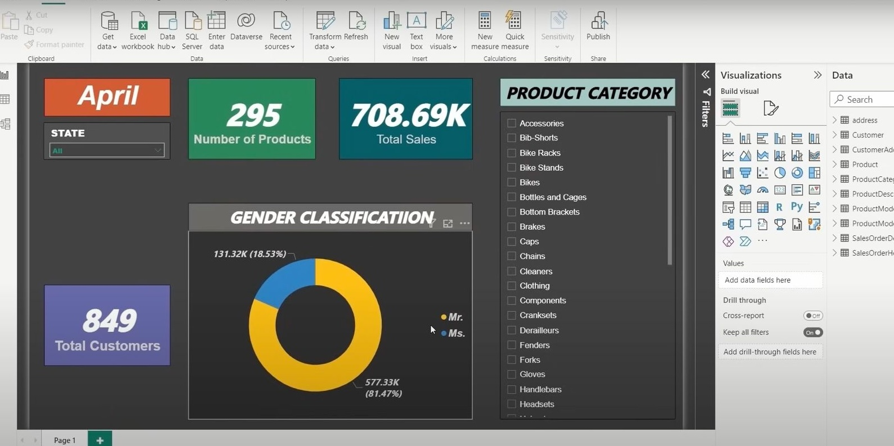

# End-to-End Azure Data Engineering Project

This project demonstrates an end-to-end data engineering pipeline using Azure services, including Databricks, Azure Data Lake Storage (ADLS), Azure Data Factory, Azure Synapse Analytics, and Power BI for data processing, transformation, storage, and reporting. The project uses the AdventureWorksLT2017 database as the data source and provides insights via interactive visualizations.

## Overview

This project aims to build a scalable and efficient data pipeline for data ingestion, transformation, storage, and reporting. The AdventureWorksLT2017 database, a sample SQL Server database, serves as the source. The pipeline includes stages for data ingestion, data transformation, data storage, and data visualization using Power BI.

## Architecture

The Architecture diagram of the project is as follows:

## Phases of the Project

### 1. Environment Setup

#### SQL Server Management Studio (SSMS):

- Set up the AdventureWorksLT2017 database locally on SQL Server.
- Configured the database to store data for experimentation and pipeline testing.

#### Azure Services Configuration:

Set up the following Azure resources:
- **Azure Data Lake Storage (ADLS) Gen2** to store raw, cleaned, and transformed data.
- **Azure Databricks** for performing data transformations.
- **Azure Data Factory** for orchestrating data flows.
- **Azure Synapse Analytics** for querying and aggregating the transformed data.
- **Power BI** for data visualization and reporting.
- **Azure Active Directory (AAD)** for secure access management.
- **Azure Key Vault** for securely managing credentials.

### 2. Data Ingestion

#### Ingestion Process:

- Used **Azure Data Factory** to ingest data from the AdventureWorksLT2017 SQL Server database.
- Configured a self-hosted Integration Runtime for connecting on-premises data sources to Azure.
- Data is ingested into the **Bronze Layer** of ADLS Gen2, ensuring the raw data is stored securely before any transformations are applied.
- **Data in the Bronze Layer is stored in raw format**, without any transformations, representing the unprocessed state of the data.

### 3. Data Transformation

#### Databricks Transformation:

- Data transformation tasks were executed within **Azure Databricks** notebooks, providing a scalable, cloud-based platform for processing large datasets.
- Used **Apache Spark** for distributed data processing, ensuring efficient execution of complex data transformations.

#### Key Transformations:

- Applied data validation steps, such as null checks and data type conversions.
- Cleaned data by handling missing values, removing duplicates, and standardizing formats.
- Joined multiple tables to create a comprehensive view of the sales pipeline.

#### Storing Transformed Data:

- After the transformation, the data is stored in the **Silver Layer** (for cleaned data) and **Gold Layer** (for aggregated data) within ADLS Gen2. This enables efficient querying and incremental updates in downstream systems.
- **Data in the Silver and Gold Layers is stored in Delta format**, allowing for versioning, ACID transactions, and optimized performance during querying and further transformation.

### 4. Data Loading and Querying

#### Azure Synapse Analytics Integration:

- Created a serverless SQL pool in **Azure Synapse Analytics** to query the transformed data directly from the Gold Layer in ADLS Gen2.
- Defined views and stored procedures in Synapse to facilitate complex queries and aggregation of the transformed data for reporting purposes.

#### Data Aggregation:

- Aggregated sales data by region, product, and time period for easy reporting.
- Data is structured into fact and dimension tables that enable high-performance querying.

### 5. Data Reporting

#### Power BI Visualization:

- Connected **Power BI** to **Azure Synapse Analytics** to create dynamic and interactive dashboards.
- Used **DirectQuery** to keep the data live, ensuring real-time reporting.

#### Built the following visualizations:

- **Sales Overview Dashboard**: Displays total sales, top-selling products, and customer demographics.
- **Sales Trends**: Visualizes sales over time and forecasts future sales.
- **Regional Performance**: Displays sales performance across different geographical regions.
- **Product Performance**: Analyzes sales by product category.

#### Key Features of Power BI Reports:

- **Interactive Filters**: Users can filter by region, product, or time period.
- **Charts and Tables**: Line charts, bar charts, and pivot tables for comprehensive data analysis.
- **Real-Time Data Updates**: Power BI dashboards are refreshed in near real-time with new data.

- 
- 
- 

  
  

### 6. End-to-End Pipeline Testing

#### Testing Strategy:

- Validated the pipeline by running test cases to ensure data was ingested, transformed, and loaded correctly.
- Verified that data in Power BI matched expectations and that reports were up-to-date with the latest data from the SQL Server source.

#### Performance Tuning:

- Optimized **Azure Synapse Analytics** queries for faster performance using partitioning and indexing.
- Fine-tuned **Databricks notebooks** for efficient transformations on large datasets.

## Security and Governance

### 1. Role-Based Access Control (RBAC)

- Configured **Azure Active Directory (AAD)** to manage access to resources.
- Defined roles for users and services to limit access to only the necessary resources.
- Implemented least privilege access to ensure that each service or user has only the permissions required to perform their job.

### 2. Data Security:

- Used **Azure Key Vault** to securely store connection strings, secrets, and credentials required for accessing data sources.
- Configured encryption at rest and in transit for all sensitive data stored in ADLS Gen2.

### 3. Data Quality:

- Applied data validation rules during the transformation process in **Databricks** to ensure high-quality data.
- Used **Azure Monitor** to track data pipeline performance and catch any issues early in the process.

## Tools and Technologies Used

- **Data Source**: AdventureWorksLT2017 (SQL Server)
- **Cloud Platform**: Microsoft Azure
- **Data Storage**: Azure Data Lake Storage (ADLS) Gen2
- **Data Integration**: Azure Data Factory
- **Data Transformation**: Azure Databricks (Apache Spark)
- **Data Querying**: Azure Synapse Analytics
- **Data Visualization**: Power BI
- **Security**: Azure Active Directory, Azure Key Vault, Encryption at Rest/Transit

## Conclusion

This end-to-end Azure data engineering pipeline showcases the power of Azure services for building scalable and efficient data pipelines. By leveraging **Databricks** for transformations, **Azure Data Factory** for orchestration, **Azure Synapse Analytics** for querying, and **Power BI** for reporting, the project effectively demonstrates how to handle large datasets from ingestion to insights.
